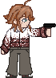
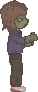
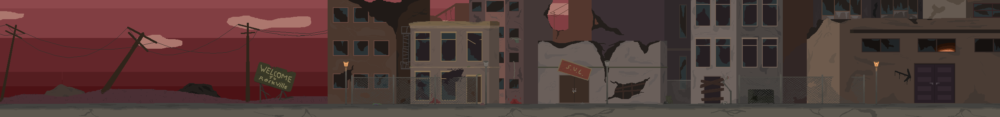

# Final Remedy
An survival horror game made to have an social impact. What are lives worth? Can you ever take them?  
Is it possible to save everyone, or is it good enough to only save the people who can be saved?

### Story
Lucia, a brave nurse, has arrived in Rockville, a destroyed city infested with zombies.  
She will have to make choices to survive.  
Killing or healing zombies, there is no avoiding either.  
Will she be capable of staying sane in this dystopian place?  

### Lucia
 

### Killing
Bullets are found throughout the city, but how will Lucia use them?  
Will you, as the player, choose to kill all the zombies?  

 

### Curing
Injections are also everywhere, so if given the choice Lucia could heal the zombies.  
Can Lucia find enough injection to heal everyone? Or will she have to kill many zombies?  
 

### Sanity
Killing and healing have their consequences.  
If Lucia decides to kill zombies, her sanity will go down 
If she decides to heal them, her sanity will go up 
How will Lucia's sanity affect her?  
Will her fate depend on her sanity?  

### Rockville
Explore a dystopian city and find items which help your quests.

