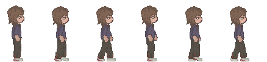
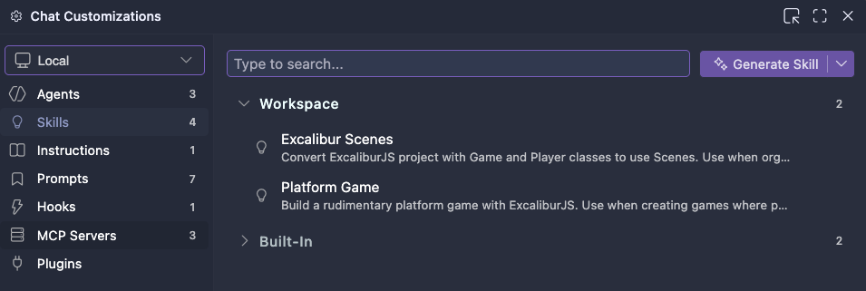

# Final Remedy

Lucia, a brave nurse, has arrived in Rockville, a destroyed city infested with zombies.  
She will have to make choices to survive.  
Killing or healing zombies, there is no avoiding either.  
Will she be capable of staying sane in this dystopian place?  

### Lucia
 

### Killing
Bullets are found throughout the city, but how will Lucia use them?  
Will you, as the player, choose to kill all the zombies?  

 

### Curing
Injection are also everywhere, so if given the choice Lucia could heal the zombies.  
Can Lucia find enough injection to heal everyone? Or will she have to kill many zombies?  

   

### Resoluties

| Widescreen 16/9 | Retro 4/3 |
|---|---|
| 640 × 360 | 512 × 384 |
| 800 × 450 | 640 × 480 |
| 1280 × 720 | 800 × 600 |

   

### AI Instructies

Als je copilot binnen dit project gebruikt zullen de [Excalibur instructions](./.github/copilot-instructions.md) automatisch meegenomen worden. Dit kan je zien door in het AI venster op settings te klikken. Je kan de beschikbare *skills* gebruiken door een `/` te typen. (*bv. voor het bouwen van een platform game of het toevoegen van scenes*).

⚠️ *AI kan fouten maken! Vergelijk de code altijd met de Excalibur documentatie en lesstof*

